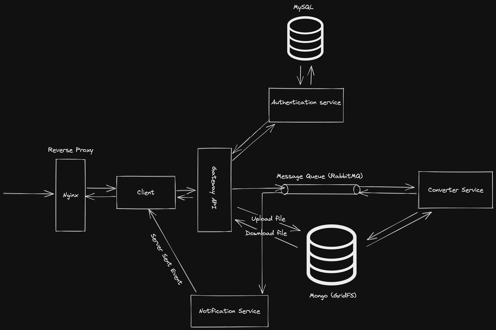

# Convert RGB Image to Grayscale Image (Microservices)

## Project Description
Simple application responsbile for converting RGB images to grayscale. Main goal or objective for this project was to build somehow real world project 
and learn something about Microservices architecture. The system design is heavily inspired by FreeCodeCamp tutorial: 
https://www.youtube.com/watch?v=hmkF77F9TLw&list=PLHzzSkMFgDo8rg9m4n64OTzszpsmziGDd&index=1&ab_channel=freeCodeCamp.org. 
I've added very simple client service (used React for that) and changed notification service - instead of sending notification email to user, 
I've decided to use Server Send Events to inform user that image is converted and ready to download. Below is a system design diagram:

## Technologies used
<ol>
  <li>TypeScript - used for every service except Converter. Mainly because I'm learning it and simply enjoy working with TS</li>
  <li>Python - used for Converter Service because of PIL (Python Image Library)</li>
  <li>RabbitMQ - message queue, for this simple project RabbitMQ is more suitable than Kafka (https://www.simplilearn.com/kafka-vs-rabbitmq-article#what_is_kafka_used_for)</li>
  <li>Docker/docker-compose</li>
  <li>Mongo (GridFS) - I'm storing only small images (<8MB) so in this case Mongo's GridFS is slightly faster than AWS S3 (https://simonjcarr.medium.com/mongodb-gridfs-vs-s3-storage-f5ba1ebcc490) </li>
  <li>MySQL - for keeping user data</li>
  <li>Server Send Event - I didn't want to use SMTP so notification service is consuming messages from queue and sends event to client service</li>
  <li>Nginx - reverse proxy</li>
</ol>

## How to install/run project
<ol>
  <li>Clone repo</li>
  <li>Run docker compose command in project directory: <code>docker-compose -f docker-compose.dev.yaml up -d</code> (TODO: notification service starts before RabbitMQ and throws error, for now Notification Service needs to be restarted manually)
</ol>

## TODO
- [ ] use Kubernetes for orchestration
- [ ] deploy to AWS?
- [ ] add video displaying usage of the application
